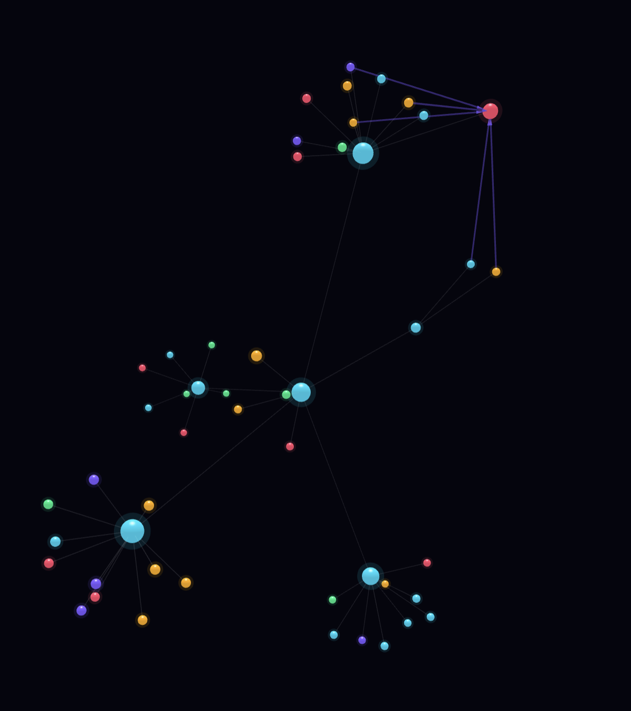
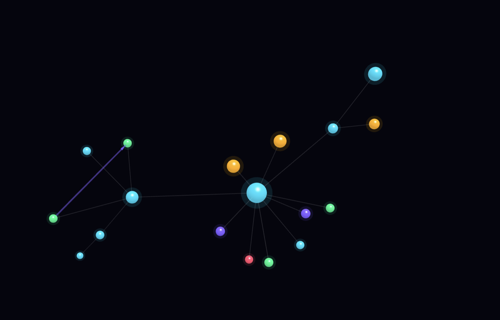
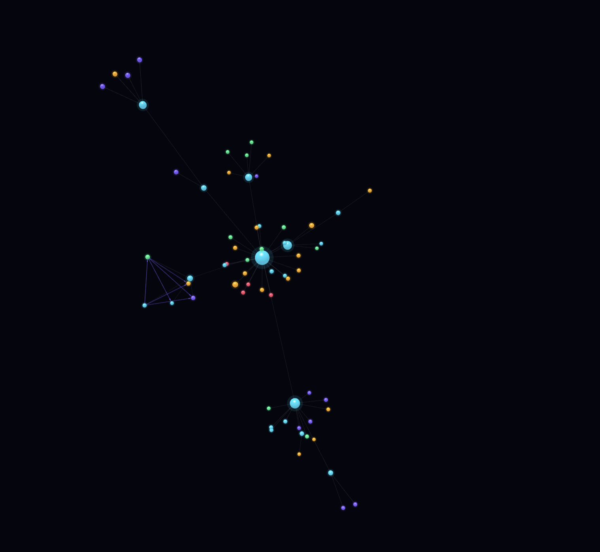

# 🌌 GitSphere

**GitSphere** is an advanced, AI-powered GitHub repository analyzer and immersive 3D architecture visualizer. It transforms complex codebases into intuitive, interactive knowledge graphs—helping developers, researchers, and technical leaders quickly understand how a project is structured and how its components truly interact.

By combining parallelized GitHub API fetching, regex-driven structural parsing, and **DeepSeek AI**, GitSphere goes beyond surface-level mapping. It doesn’t just show connections—it explains *why they exist*, turning dense repositories into clear, navigable systems.

<table align="center">
  <tr>
    <td></td>
    <td></td>
    <td></td>
  </tr>
  <tr>
    <td></td>
    <td></td>
    <td></td>
  </tr>
</table>

---

## ✨ Key Features

| 🌐 Interactive 3D Graph | 🧠 AI Architecture Brain | 📊 Health & Analytics |
| :--- | :--- | :--- |
| Explore repositories as dynamic, visually rich graphs with glossy nodes, flowing edges, and a starfield backdrop. | Leverages DeepSeek AI to explain file roles, architectural patterns, and complex dependencies. | Automated scoring based on documentation, maintenance, CI/CD, and community engagement. |

| ⚡ High-Performance | 🔍 Multi-Language | 💾 Portable Intelligence |
| :--- | :--- | :--- |
| Parallel processing (`ThreadPoolExecutor`) with intelligent retry strategies for large-scale analysis. | Built-in parsers for 10+ languages including Python, JS/TS, Go, Rust, Java, C++, and more. | Save fully analyzed architectures as portable JSON files for instant, offline reloads. |

---

## 🚀 Immersive Visualization

GitSphere isn't just a tool; it's an experience. The 3D viewer provides:
- **Glossy Node Rendering**: Nodes are styled by their role (entry point, source, config, test).
- **Dynamic Relationship Explanations**: Click any link to have AI explain the logic flow between components.
- **"Explain for Lower Level" (EL5)**: On-demand simplification of complex architectural concepts for non-technical stakeholders.
- **Structural Insights**: Identify tightly coupled modules and critical dependency hubs at a glance.

---

## 🎯 Ideal Use Cases

- **🔍 Research & Large-Scale Analysis**: Quickly analyze hundreds of repositories for trend discovery or academic research.
- **🧭 Codebase Onboarding**: Help new contributors understand unfamiliar projects visually, reducing ramp-up time by up to 70%.
- **🛡️ Architecture & Security Audits**: Identify single points of failure and hidden dependencies in legacy systems.
- **📈 Portfolio Presentation**: Visualize your own projects as beautiful, interactive graphs to showcase architectural depth.

---

## 🛠️ Supported Languages

GitSphere features robust import/export parsing for:
- **Web**: JavaScript (ES6/CommonJS), TypeScript, JSX, TSX
- **Backend**: Python, Go, Rust, Java, Ruby
- **System**: C, C++, Swift
- **Config**: Docker, Makefile, TOML, YAML, JSON, and more

---

## 🚦 Getting Started

### Prerequisites
- Python 3.8+
- GitHub Personal Access Token (PAT)
- DeepSeek API Key (Recommended for AI features)

### Installation

1. **Clone the repository**
   ```bash
   git clone https://github.com/Nyvora-Vision-Labs/GitSphere.git
   cd GitSphere
   ```

2. **Install dependencies**
   ```bash
   pip install -r requirements.txt
   ```

3. **Configure Environment**
   Create a `.env` file in the root directory:
   ```env
   GITHUB_TOKEN=your_github_pat_here
   DEEPSEEK_API_KEY=your_deepseek_key_here
   ```

### Running the Application

**Web Interface (Recommended)**
```bash
python web_app.py
```
Open `http://127.0.0.1:8000` to start analyzing repositories through the interactive UI.

**CLI Report Generator**
```bash
python repo_report.py owner/repo --output ./reports
```

---

## 🏗️ Tech Stack

- **Backend**: Python, Flask, Requests
- **Frontend**: 3D-Force-Graph, Three.js, CSS2DRenderer
- **AI Engine**: DeepSeek-Chat (LLM)
- **Data Flow**: ThreadPoolExecutor, GitHub REST API v3

---

## 📜 License

Distributed under the MIT License. See `LICENSE` for more information.

---

<p align="center">
  Built with ❤️ by <b>Nyvora Vision Labs</b>
</p>
